# Tri-Tracker System

## Overview

Tri-Tracker System is a Python console application for managing triathlon competitors, events, results, reports, and searches.

The program allows users to register competitors, create events, record results, generate reports, and search stored information. It uses text files to store data and a separate custom validation module to make sure user input is checked before it is accepted.

---

## Project Files

This project contains two Python files:

```text
tri_tracker_system.py
KD_Val.py
README.md
```

When the program runs, it also creates and uses these text files:

```text
competitors.txt
events.txt
results.txt
```

These text files store the competitor, event, and results data used by the system.

---

## Important Note

Both Python files must be kept in the same folder:

```text
tri_tracker_system.py
KD_Val.py
```

The main program imports the validation file using:

```python
import KD_Val
```

If `KD_Val.py` is missing or in a different folder, the program will not run correctly.

---

## Features

### Main Menu

The system includes a main menu with options for:

* Registration
* Recording results
* Generating reports
* Searching records
* Exiting the program

### Competitor Management

Users can:

* View competitors
* Add new competitors
* Update competitor details
* Delete competitors
* Reset competitor data

Competitor records include:

* Competitor number
* Surname
* Forename
* Gender
* Age

### Event Management

Users can:

* View events
* Add new events
* Update event details
* Delete events
* Reset event data

### Results Management

Users can:

* View results
* Add results
* Update results
* Delete results
* Reset results

### Registration

The program allows competitors to be registered for events.

### Reports

The system can generate reports such as:

* Registered competitor information
* Event lists
* Event result details

### Search

Users can search for:

* Competitors
* Events
* Results

### Input Validation

The project includes a separate validation module called `KD_Val.py`.

This file contains custom validation functions for:

* Integer input
* Range checks
* Names and letter-only input
* Gender input
* Age input
* Event names
* Results
* Yes/no responses
* Duplicate entry checks
* Update confirmations

---

## Technologies Used

* Python 3
* Console-based menus
* File handling
* Lists
* Dictionaries
* Functions
* Random module
* OS module
* Custom validation module

---

## How to Run the Program

### Requirements

Make sure Python 3 is installed on your computer.

### Steps

1. Download or clone the repository.
2. Make sure `tri_tracker_system.py` and `KD_Val.py` are in the same folder.
3. Open the folder in a terminal or command prompt.
4. Run the main program using:

```bash
python tri_tracker_system.py
```

The program will create the required text files automatically if they do not already exist.

---

## Example Project Structure

```text
PFA2_STU30035781/
│
├── tri_tracker_system.py
├── KD_Val.py
├── README.md
│
├── competitors.txt
├── events.txt
└── results.txt
```

---

## Screenshots

### Main Menu

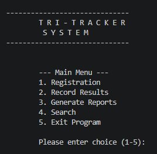

### Registration Menu

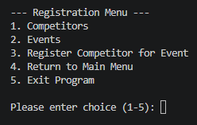

### Competitor Menu

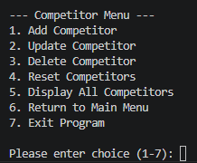

### Add Competitor Screen

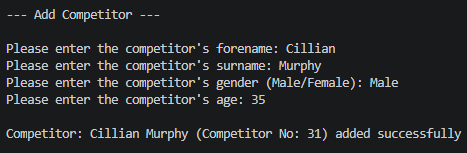

### Event Menu

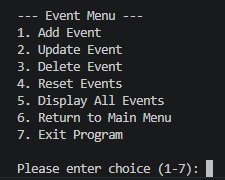

### Results Menu

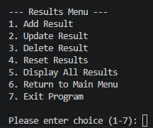

### Add Results Screen

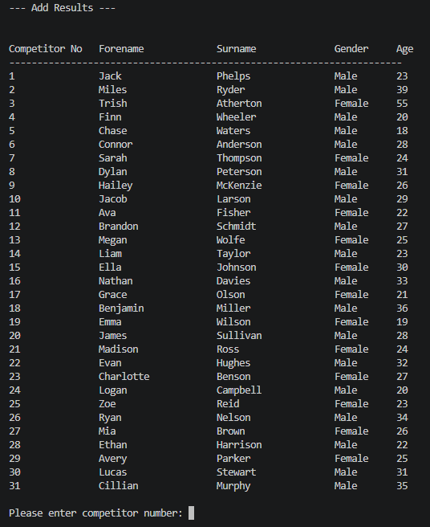

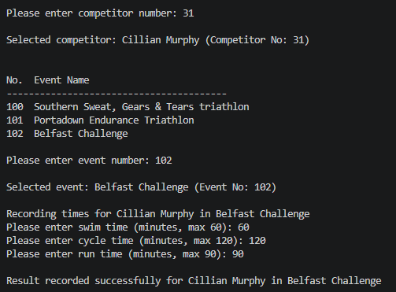

### Reports Menu

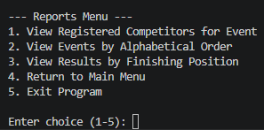

### Search Menu

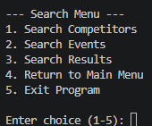

### Search Results Screen

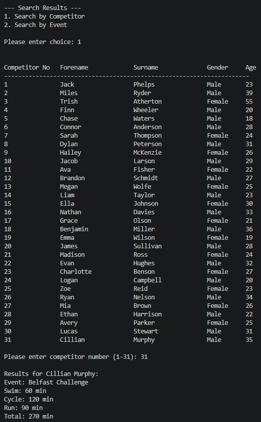

### Exit Screen

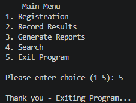

---

## Learning Outcomes

This project demonstrates:

* Python programming fundamentals
* Creating and using functions
* Modular programming
* Importing custom modules
* File reading and writing
* Data validation
* Menu-driven program design
* Working with lists and dictionaries
* Searching, updating, and deleting records
* Generating simple reports

---

## Author

Kaitlyn Deschner

---

## License

This project was created for educational purposes.
